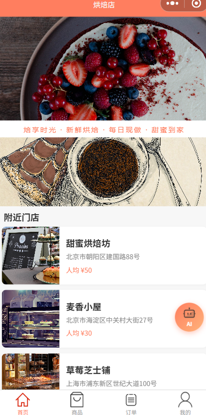
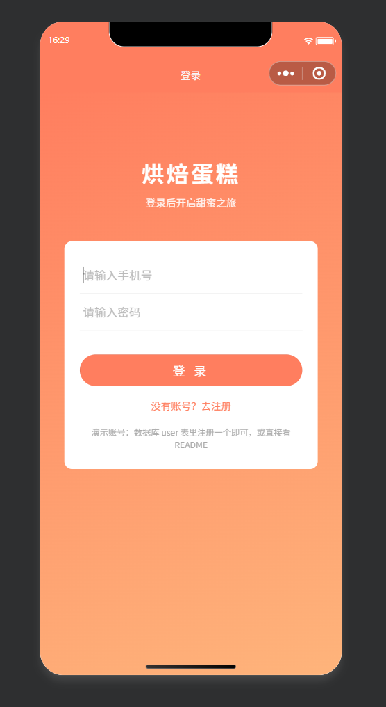
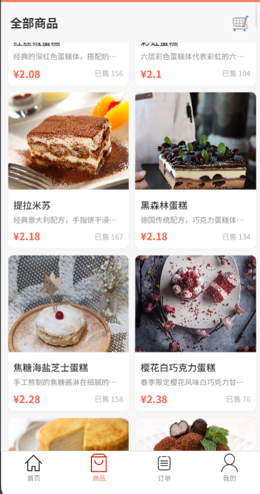
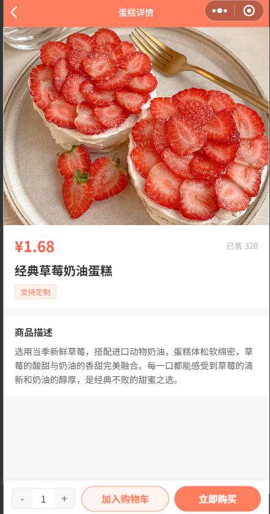
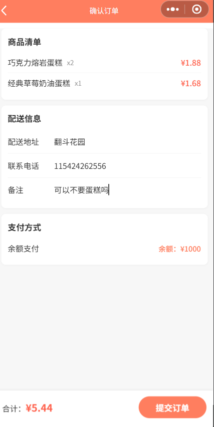
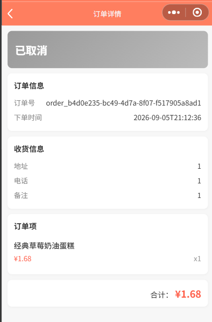
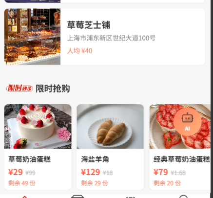
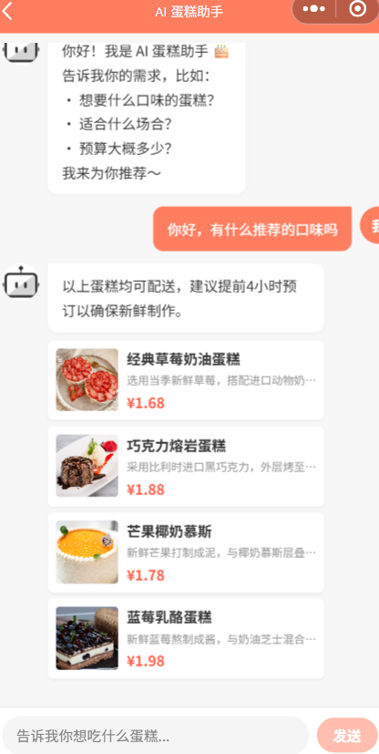

# 烘焙蛋糕小程序

基于 Spring Boot + 微信小程序的在线蛋糕商城平台，支持 AI 智能推荐、限时抢购、订单管理等核心功能。

## 项目结构

```
bakeryShop/
├── src/                    # Spring Boot 后端
│   └── main/java/com/cake/platform/
│       ├── ai/            # AI 智能推荐模块
│       ├── bakery/        # 门店管理
│       ├── cake/          # 蛋糕商品
│       ├── cart/          # 购物车
│       ├── category/      # 分类管理
│       ├── order/         # 订单管理
│       ├── review/        # 评价模块
│       ├── Sale/          # 限时抢购
│       └── user/          # 用户管理
└── miniprogram/           # 微信小程序前端
    ├── pages/             # 页面
    ├── components/        # 组件
    ├── images/            # 图片资源
    └── utils/             # 工具函数
```

## 技术栈

### 后端
- **Spring Boot 3.x** + Java 21
- **MyBatis-Plus** 数据持久层
- **MySQL 8.0** 数据库
- **Redis** 缓存 + 秒杀库存管理
- **RabbitMQ** 异步订单处理
- **JWT** 身份认证
- **Spring AI** 接入大模型

### 前端
- **微信小程序** 原生开发
- **TypeScript** + **Less**
- 自定义请求封装，统一 Token 注入

## 功能模块

### 1. 用户模块
- 手机号注册/登录
- JWT Token 认证
- 个人中心

### 2. 首页模块
- 轮播 Banner 展示
- 门店列表
- 限时抢购入口
- AI 助手悬浮按钮

| 平台首页 | 登录界面 |
|:---:|:---:|
|  |  |

### 3. 商品模块
- 蛋糕分类浏览
- 商品详情（图片、价格、描述）
- 加入购物车 / 立即购买

| 商品样例图 | 商品详情 |
|:---:|:---:|
|  |  |

### 4. 订单模块
- 订单创建与结算
- 订单列表查看
- 订单详情（状态、商品明细）
- 取消订单

| 订单创建 | 订单详情 |
|:---:|:---:|
|  |  |

### 5. 限时抢购
- Redis 预减库存 + Lua 脚本原子操作
- RabbitMQ 异步创建订单
- 秒杀详情与订单管理

| 限时抢购 |
|:---:|
|  |

### 6. AI 智能推荐
- 基于 Spring AI 接入大语言模型
- 根据用户偏好推荐蛋糕
- 支持多轮对话

| AI 智能推荐 |
|:---:|
|  |

### 7. 评价模块
- 订单完成后评价
- 评分 + 文字评价

## 快速开始

### 环境要求
- JDK 21+
- Maven 3.8+
- MySQL 8.0+
- Redis 7.0+
- RabbitMQ 3.12+
- 微信开发者工具

### 后端启动

1. **创建数据库**
```sql
CREATE DATABASE bakery_shop DEFAULT CHARACTER SET utf8mb4;
```

2. **导入数据表**
   - 执行 `src/main/resources/sql/` 目录下的 SQL 文件

3. **修改配置**
   - 编辑 `src/main/resources/application.yml`
   - 配置数据库连接、Redis、RabbitMQ 地址

4. **启动项目**
```bash
mvn spring-boot:run
```
后端默认运行在 `http://localhost:8082`

### 前端启动

1. **打开微信开发者工具**
2. **导入项目**：选择 `miniprogram/` 目录
3. **修改配置**：编辑 `miniprogram/config.ts`，将 `BASE_URL` 改为后端地址
```typescript
export const BASE_URL = 'http://localhost:8082'
```
4. **编译运行**

## 数据库设计

### 核心表
| 表名 | 说明 |
|---|---|
| `user` | 用户表 |
| `bakery` | 门店表 |
| `cake` | 蛋糕商品表 |
| `category` | 分类表 |
| `orders` | 订单主表 |
| `order_item` | 订单明细表 |
| `cart` | 购物车表 |
| `flash_sale` | 限时抢购活动表 |
| `flash_sale_order` | 秒杀订单表 |
| `review` | 评价表 |

## API 接口

### 用户相关
- `POST /api/user/register` - 注册
- `POST /api/user/login` - 登录

### 蛋糕商品
- `GET /api/cake/list/{bakeryId}` - 门店蛋糕列表
- `GET /api/cake/detail/{cakeId}` - 蛋糕详情

### 订单
- `POST /api/order/create` - 创建订单
- `GET /api/order/list` - 订单列表
- `GET /api/order/{orderId}` - 订单详情
- `PUT /api/order/cancel/{orderId}` - 取消订单

### 限时抢购
- `GET /api/flashSale/list` - 活动列表
- `POST /api/flashSale/seckill/{flashSaleId}` - 秒杀
- `GET /api/flashSale/order/list` - 秒杀订单列表

### AI 推荐
- `GET /ai/recommend` - 获取 AI 蛋糕推荐

## 项目亮点

1. **Redis + Lua 秒杀方案**：保证库存扣减原子性，防止超卖
2. **RabbitMQ 异步下单**：削峰填谷，提升系统吞吐量
3. **Spring AI 智能推荐**：接入大模型，提供个性化蛋糕推荐
4. **前后端分离**：后端 RESTful API，小程序端独立部署
5. **统一异常处理**：GlobalExceptionHandler 全局捕获异常
6. **图片静态资源映射**：Spring Boot 直接托管本地图片

## 截图展示

| 页面 | 截图 |
|---|---|
| 平台首页 |  |
| 登录界面 |  |
| 商品样例 |  |
| 商品详情 |  |
| 订单创建 |  |
| 订单详情 |  |
| 限时抢购 |  |
| AI 推荐 |  |

## License

MIT
